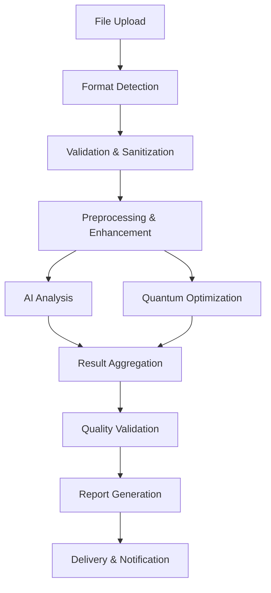
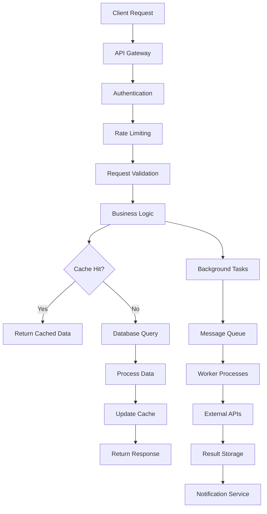

# BlueprintBot v2 - Architecture Overview 🏗️

## Executive Summary

BlueprintBot v2 is a cutting-edge, enterprise-grade platform that revolutionizes blueprint analysis through the integration of artificial intelligence and quantum computing. This document provides a comprehensive overview of the system architecture, design principles, and technical implementation details.

## 🎯 System Overview

### Vision and Mission
**Vision**: To transform the global construction industry through AI-powered blueprint analysis and quantum-enhanced optimization.

**Mission**: Provide construction professionals with the most advanced, accurate, and efficient blueprint analysis platform, reducing waste, improving safety, and accelerating project delivery.

### Key Capabilities
- **AI-Powered Analysis**: 97%+ accuracy in blueprint interpretation and object detection
- **Quantum Optimization**: Advanced algorithms for resource allocation and scheduling
- **Multi-Format Support**: PDF, DWG, DXF, images, and more
- **Real-Time Processing**: Sub-second response times for most operations
- **Enterprise Scale**: Support for thousands of concurrent users
- **Cloud-Native**: Designed for modern cloud infrastructure

## 🏛️ High-Level Architecture

```
┌─────────────────────────────────────────────────────────────────────────────────┐
│                                   Client Layer                                   │
├─────────────────────────────────────────────────────────────────────────────────┤
│  Web Browser  │  Mobile App  │  Desktop App  │  API Clients  │  Third-party    │
│     (React)   │   (React     │   (Electron)  │   (Python,    │  Integrations   │
│               │    Native)   │               │    Node.js)   │                 │
└─────────────────────────────────────────────────────────────────────────────────┘
                                        │
                                        ▼
┌─────────────────────────────────────────────────────────────────────────────────┐
│                              API Gateway Layer                                   │
├─────────────────────────────────────────────────────────────────────────────────┤
│              Traefik Reverse Proxy & Load Balancer                             │
│  ┌─────────────┐  ┌─────────────┐  ┌─────────────┐  ┌─────────────┐           │
│  │   SSL/TLS   │  │    Rate     │  │    CORS     │  │   Request   │           │
│  │ Termination │  │  Limiting   │  │  Handling   │  │  Routing    │           │
│  └─────────────┘  └─────────────┘  └─────────────┘  └─────────────┘           │
└─────────────────────────────────────────────────────────────────────────────────┘
                                        │
                                        ▼
┌─────────────────────────────────────────────────────────────────────────────────┐
│                            Application Layer                                     │
├─────────────────────────────────────────────────────────────────────────────────┤
│                            FastAPI Application Server                           │
│  ┌─────────────┐  ┌─────────────┐  ┌─────────────┐  ┌─────────────┐           │
│  │    REST     │  │  WebSocket  │  │   GraphQL   │  │    gRPC     │           │
│  │     API     │  │     API     │  │     API     │  │     API     │           │
│  └─────────────┘  └─────────────┘  └─────────────┘  └─────────────┘           │
│                                                                                 │
│  ┌─────────────┐  ┌─────────────┐  ┌─────────────┐  ┌─────────────┐           │
│  │Authentication│  │Authorization│  │  Validation │  │   Logging   │           │
│  │   & Session  │  │    (RBAC)   │  │ & Sanitize  │  │ & Monitoring│           │
│  └─────────────┘  └─────────────┘  └─────────────┘  └─────────────┘           │
└─────────────────────────────────────────────────────────────────────────────────┘
                                        │
                                        ▼
┌─────────────────────────────────────────────────────────────────────────────────┐
│                              Business Logic Layer                               │
├─────────────────────────────────────────────────────────────────────────────────┤
│  ┌─────────────────────┐  ┌─────────────────────┐  ┌─────────────────────┐     │
│  │   Blueprint         │  │    Quantum          │  │      AI/ML          │     │
│  │   Analyzer          │  │   Processor         │  │     Engine          │     │
│  │                     │  │                     │  │                     │     │
│  │ • File Processing   │  │ • Circuit Builder   │  │ • Computer Vision   │     │
│  │ • Format Detection  │  │ • Algorithm Exec    │  │ • NLP Processing    │     │
│  │ • Content Extract   │  │ • Optimization      │  │ • Model Inference   │     │
│  │ • Analysis Pipeline │  │ • Error Mitigation  │  │ • Training Pipeline │     │
│  └─────────────────────┘  └─────────────────────┘  └─────────────────────┘     │
│                                        │                                        │
│  ┌─────────────────────┐  ┌─────────────────────┐  ┌─────────────────────┐     │
│  │    Workflow         │  │     Report          │  │   Notification      │     │
│  │   Orchestrator      │  │   Generator         │  │     Service         │     │
│  │                     │  │                     │  │                     │     │
│  │ • Task Scheduling   │  │ • Template Engine   │  │ • Email/SMS/Push    │     │
│  │ • State Management  │  │ • Export Formats    │  │ • Webhook Delivery  │     │
│  │ • Error Handling    │  │ • Visualization     │  │ • Real-time Updates │     │
│  │ • Progress Tracking │  │ • Custom Reports    │  │ • Event Broadcasting│     │
│  └─────────────────────┘  └─────────────────────┘  └─────────────────────┘     │
└─────────────────────────────────────────────────────────────────────────────────┘
                                        │
                                        ▼
┌─────────────────────────────────────────────────────────────────────────────────┐
│                              Data Access Layer                                  │
├─────────────────────────────────────────────────────────────────────────────────┤
│  ┌─────────────────────┐  ┌─────────────────────┐  ┌─────────────────────┐     │
│  │    Database         │  │      Cache          │  │   Message Queue     │     │
│  │    Manager          │  │     Manager         │  │     Manager         │     │
│  │                     │  │                     │  │                     │     │
│  │ • Connection Pool   │  │ • Redis Client      │  │ • Celery Workers    │     │
│  │ • Query Builder     │  │ • Cache Strategies  │  │ • Task Scheduling   │     │
│  │ • Migration Mgmt    │  │ • Invalidation      │  │ • Result Backend    │     │
│  │ • Transaction Mgmt  │  │ • Distributed Cache │  │ • Dead Letter Queue │     │
│  └─────────────────────┘  └─────────────────────┘  └─────────────────────┘     │
└─────────────────────────────────────────────────────────────────────────────────┘
                                        │
                                        ▼
┌─────────────────────────────────────────────────────────────────────────────────┐
│                            Infrastructure Layer                                 │
├─────────────────────────────────────────────────────────────────────────────────┤
│  ┌─────────────────────┐  ┌─────────────────────┐  ┌─────────────────────┐     │
│  │    PostgreSQL       │  │       Redis         │  │   Elasticsearch     │     │
│  │    Database         │  │       Cache         │  │   Search Engine     │     │
│  │                     │  │                     │  │                     │     │
│  │ • ACID Compliance   │  │ • In-Memory Store   │  │ • Full-Text Search  │     │
│  │ • Replication       │  │ • Pub/Sub Messaging │  │ • Analytics         │     │
│  │ • Backup/Recovery   │  │ • Session Storage   │  │ • Log Aggregation   │     │
│  │ • Performance Opt   │  │ • Distributed Lock │  │ • Real-time Indexing│     │
│  └─────────────────────┘  └─────────────────────┘  └─────────────────────┘     │
│                                                                                 │
│  ┌─────────────────────┐  ┌─────────────────────┐  ┌─────────────────────┐     │
│  │     MinIO           │  │    Prometheus       │  │      Grafana        │     │
│  │  Object Storage     │  │   Metrics Store     │  │   Visualization     │     │
│  │                     │  │                     │  │                     │     │
│  │ • S3 Compatible     │  │ • Time Series DB    │  │ • Dashboards        │     │
│  │ • Distributed       │  │ • Alerting Rules    │  │ • Alerting          │     │
│  │ • Versioning        │  │ • Service Discovery │  │ • User Management   │     │
│  │ • Encryption        │  │ • Data Retention    │  │ • Plugin Ecosystem  │     │
│  └─────────────────────┘  └─────────────────────┘  └─────────────────────┘     │
└─────────────────────────────────────────────────────────────────────────────────┘
```

## 🧠 Core Components Deep Dive

### 1. Blueprint Analyzer Engine

The Blueprint Analyzer is the central orchestrator that coordinates the entire analysis pipeline.

#### Architecture
```python
class BlueprintAnalyzer:
    """
    Central coordinator for blueprint analysis workflows
    """
    
    Components:
    ├── File Processor: Multi-format file handling and validation
    ├── Image Preprocessor: Enhancement and normalization
    ├── AI Engine Interface: Computer vision and NLP integration
    ├── Quantum Processor Interface: Optimization algorithm execution
    ├── Analysis Pipeline: Workflow orchestration and state management
    ├── Result Aggregator: Data compilation and formatting
    └── Report Generator: Output generation in multiple formats
```

#### Key Features
- **Multi-Format Support**: PDF, DWG, DXF, PNG, JPEG, TIFF, BMP
- **Intelligent Preprocessing**: Automatic image enhancement and noise reduction
- **Parallel Processing**: Concurrent execution of analysis tasks
- **State Management**: Persistent workflow state with recovery capabilities
- **Quality Assurance**: Multi-stage validation and error detection

#### Processing Pipeline


### 2. Quantum Computing Engine

The Quantum Processor leverages quantum algorithms for complex optimization problems in construction and engineering.

#### Architecture
```python
class QuantumProcessor:
    """
    Quantum computing integration and algorithm execution
    """
    
    Components:
    ├── Circuit Builder: Dynamic quantum circuit construction
    ├── Algorithm Library: Pre-built quantum algorithms (QAOA, VQE, etc.)
    ├── Backend Manager: Multi-provider quantum backend support
    ├── Optimization Engine: Resource allocation and scheduling
    ├── Error Mitigation: Noise reduction and error correction
    ├── Result Processor: Quantum state interpretation
    └── Performance Monitor: Quantum advantage measurement
```

#### Supported Quantum Algorithms
- **QAOA (Quantum Approximate Optimization Algorithm)**: Resource allocation optimization
- **VQE (Variational Quantum Eigensolver)**: Material property simulation
- **Quantum Machine Learning**: Enhanced pattern recognition
- **Quantum Fourier Transform**: Signal processing and analysis
- **Grover's Algorithm**: Database search optimization
- **Shor's Algorithm**: Cryptographic applications

#### Quantum Backends
- **IBM Quantum**: Real quantum hardware access via IBM Quantum Network
- **Q-CTRL**: Quantum control and optimization platform
- **Local Simulators**: Qiskit Aer, Cirq simulators
- **Cloud Simulators**: AWS Braket, Azure Quantum

### 3. AI/ML Engine

The AI Engine provides comprehensive machine learning capabilities for blueprint analysis and interpretation.

#### Architecture
```python
class AdvancedAIEngine:
    """
    Artificial intelligence and machine learning processing
    """
    
    Components:
    ├── Computer Vision Module: Image analysis and object detection
    ├── NLP Processor: Text extraction and interpretation
    ├── Model Manager: ML model lifecycle management
    ├── Training Pipeline: Custom model training and fine-tuning
    ├── Inference Engine: Real-time prediction and classification
    ├── Feature Extractor: Advanced feature engineering
    └── Performance Optimizer: Model optimization and acceleration
```

#### AI Models and Capabilities
- **Object Detection**: YOLOv8, Faster R-CNN for blueprint element identification
- **Image Segmentation**: U-Net, Mask R-CNN for precise area delineation
- **Text Recognition**: OCR with Tesseract and custom models
- **Natural Language Processing**: BERT, GPT for specification analysis
- **Predictive Analytics**: Time series forecasting for project planning
- **Anomaly Detection**: Statistical and ML-based outlier identification

#### Model Training and Deployment
- **Custom Dataset Creation**: Automated labeling and augmentation
- **Transfer Learning**: Pre-trained model adaptation
- **Hyperparameter Optimization**: Automated tuning with Optuna
- **Model Versioning**: MLflow integration for experiment tracking
- **A/B Testing**: Gradual model rollout and performance comparison
- **Continuous Learning**: Online learning and model updates

### 4. API Server Architecture

The FastAPI-based server provides comprehensive API access with enterprise-grade features.

#### Architecture
```python
class APIServer:
    """
    High-performance API server with comprehensive feature set
    """
    
    Components:
    ├── Route Handlers: RESTful endpoint implementations
    ├── WebSocket Manager: Real-time communication handling
    ├── Authentication System: JWT-based auth with refresh tokens
    ├── Authorization Engine: Role-based access control (RBAC)
    ├── Validation Layer: Request/response validation and sanitization
    ├── Rate Limiter: Configurable rate limiting per endpoint
    ├── Middleware Stack: CORS, logging, monitoring, error handling
    └── Documentation Generator: Automatic OpenAPI spec generation
```

#### API Endpoints
```
Authentication & User Management:
├── POST /auth/login - User authentication
├── POST /auth/refresh - Token refresh
├── POST /auth/logout - Session termination
├── GET /users/profile - User profile retrieval
└── PUT /users/profile - Profile updates

Blueprint Management:
├── POST /blueprints/upload - File upload and validation
├── GET /blueprints/{id} - Blueprint retrieval
├── DELETE /blueprints/{id} - Blueprint deletion
└── GET /blueprints/search - Search and filtering

Analysis Operations:
├── POST /analyses/start - Analysis initiation
├── GET /analyses/{id} - Analysis status and results
├── DELETE /analyses/{id} - Analysis cancellation
└── GET /analyses/history - Analysis history

Quantum Processing:
├── POST /quantum/optimize - Quantum optimization execution
├── GET /quantum/status - Quantum backend status
├── GET /quantum/algorithms - Available algorithms
└── POST /quantum/custom - Custom circuit execution

AI/ML Services:
├── POST /ai/analyze - AI-powered analysis
├── GET /ai/models - Available models
├── POST /ai/train - Custom model training
└── GET /ai/performance - Model performance metrics

System Operations:
├── GET /health - Health check endpoint
├── GET /metrics - Prometheus metrics
├── GET /status - System status dashboard
└── POST /admin/maintenance - Maintenance operations
```

#### WebSocket API
```python
# Real-time communication endpoints
WebSocket Connections:
├── /ws/analysis/{analysis_id} - Analysis progress updates
├── /ws/notifications - User notifications
├── /ws/collaboration/{project_id} - Real-time collaboration
└── /ws/system - System-wide announcements
```

## 🗄️ Data Architecture

### Database Design

#### PostgreSQL Schema
```sql
-- Core entities and relationships
Tables:
├── users - User accounts and profiles
├── organizations - Multi-tenant organization support
├── blueprints - Blueprint metadata and file references
├── analyses - Analysis requests and configurations
├── results - Analysis results and metrics
├── quantum_jobs - Quantum processing job queue
├── ai_models - AI model registry and metadata
├── reports - Generated reports and exports
├── audit_logs - Comprehensive audit trail
└── system_config - System configuration and settings

-- Indexes and constraints
Indexes:
├── Primary keys on all tables
├── Foreign key relationships with cascading
├── Composite indexes for common query patterns
├── Partial indexes for filtered queries
└── GIN indexes for JSON and full-text search

-- Partitioning strategy
Partitioning:
├── analyses table partitioned by date
├── audit_logs table partitioned by month
└── results table partitioned by analysis_type
```

#### Redis Data Structures
```python
# Caching and session management
Redis Usage:
├── Session Storage: user:{user_id}:session
├── Analysis Cache: analysis:{id}:cache
├── Rate Limiting: rate_limit:{endpoint}:{user_id}
├── Task Queue: celery task management
├── Pub/Sub: real-time notifications
├── Distributed Locks: resource synchronization
└── Temporary Data: file upload staging
```

#### Elasticsearch Mapping
```json
{
  "blueprints": {
    "mappings": {
      "properties": {
        "title": {"type": "text", "analyzer": "standard"},
        "description": {"type": "text", "analyzer": "standard"},
        "content": {"type": "text", "analyzer": "technical"},
        "metadata": {"type": "object", "dynamic": true},
        "tags": {"type": "keyword"},
        "created_at": {"type": "date"},
        "location": {"type": "geo_point"}
      }
    }
  }
}
```

### Data Flow Architecture



## 🔒 Security Architecture

### Authentication and Authorization

#### JWT-Based Authentication
```python
# Token structure and validation
JWT Components:
├── Header: Algorithm and token type
├── Payload: User claims and permissions
├── Signature: HMAC-SHA256 verification
├── Expiration: Configurable token lifetime
└── Refresh: Secure token renewal mechanism

# Role-based access control
RBAC Model:
├── Users: Individual user accounts
├── Roles: Permission groupings (admin, user, viewer)
├── Permissions: Granular access controls
├── Resources: Protected endpoints and data
└── Policies: Dynamic access rules
```

#### Security Layers
```
Security Stack:
├── Network Security: TLS 1.3, firewall rules, VPN access
├── Application Security: Input validation, OWASP compliance
├── Data Security: Encryption at rest and in transit
├── Access Control: Multi-factor authentication, RBAC
├── Monitoring: Security event logging and alerting
└── Compliance: GDPR, SOC2, ISO 27001 readiness
```

### Data Protection

#### Encryption Strategy
```python
# Multi-layer encryption approach
Encryption Layers:
├── Database: AES-256 encryption at rest
├── File Storage: Client-side encryption before upload
├── Network: TLS 1.3 for all communications
├── Backup: Encrypted backup storage
└── Key Management: Hardware security modules (HSM)
```

#### Privacy and Compliance
```python
# Data privacy implementation
Privacy Controls:
├── Data Minimization: Collect only necessary data
├── Anonymization: PII removal and pseudonymization
├── Right to Erasure: Complete data deletion capability
├── Data Portability: Export in standard formats
├── Consent Management: Granular permission tracking
└── Audit Trail: Comprehensive access logging
```

## 📊 Monitoring and Observability

### Metrics and Monitoring

#### Prometheus Metrics
```python
# Key performance indicators
Application Metrics:
├── Request Rate: Requests per second by endpoint
├── Response Time: P50, P95, P99 latencies
├── Error Rate: HTTP error codes and exceptions
├── Throughput: Data processing rates
├── Resource Usage: CPU, memory, disk utilization
├── Queue Depth: Background task queue sizes
├── Cache Hit Rate: Cache performance metrics
└── Custom Metrics: Business-specific KPIs

# Infrastructure metrics
System Metrics:
├── Database Performance: Query times, connection pools
├── Quantum Processing: Circuit execution times, success rates
├── AI Model Performance: Inference times, accuracy scores
├── Network Performance: Bandwidth, latency, packet loss
└── Storage Performance: IOPS, throughput, capacity
```

#### Grafana Dashboards
```yaml
# Pre-configured monitoring dashboards
Dashboards:
├── Application Overview: High-level system health
├── API Performance: Endpoint-specific metrics
├── Database Monitoring: PostgreSQL performance
├── Quantum Processing: Quantum job tracking
├── AI/ML Monitoring: Model performance and usage
├── Infrastructure: Server and container metrics
├── Security Dashboard: Security events and alerts
└── Business Metrics: User engagement and usage
```

### Logging and Tracing

#### Structured Logging
```python
# Comprehensive logging strategy
Log Categories:
├── Application Logs: Business logic and errors
├── Access Logs: API request/response logging
├── Security Logs: Authentication and authorization events
├── Audit Logs: Data access and modification tracking
├── Performance Logs: Slow queries and operations
├── Integration Logs: External API interactions
└── System Logs: Infrastructure and deployment events

# Log format and retention
Log Management:
├── Format: Structured JSON logging
├── Levels: DEBUG, INFO, WARN, ERROR, CRITICAL
├── Rotation: Daily rotation with compression
├── Retention: 90 days for application logs
├── Aggregation: Centralized log collection
└── Analysis: Elasticsearch and Kibana integration
```

#### Distributed Tracing
```python
# Request tracing across services
Tracing Implementation:
├── Trace ID: Unique identifier for request chains
├── Span Tracking: Individual operation timing
├── Context Propagation: Cross-service trace correlation
├── Performance Analysis: Bottleneck identification
├── Error Tracking: Exception propagation tracking
└── Visualization: Jaeger UI for trace analysis
```

## 🚀 Deployment Architecture

### Containerization Strategy

#### Docker Multi-Stage Build
```dockerfile
# Optimized container build process
Build Stages:
├── Base System: Ubuntu with system dependencies
├── Python Dependencies: Virtual environment setup
├── Frontend Build: React application compilation
├── Application Assembly: Code and asset integration
└── Production Image: Minimal runtime environment

# Container optimization
Optimization Techniques:
├── Layer Caching: Efficient build layer reuse
├── Multi-Architecture: AMD64 and ARM64 support
├── Security Scanning: Vulnerability assessment
├── Size Optimization: Minimal base images
└── Health Checks: Container health monitoring
```

#### Kubernetes Deployment
```yaml
# Scalable container orchestration
Kubernetes Resources:
├── Deployments: Application pod management
├── Services: Network access and load balancing  
├── ConfigMaps: Configuration management
├── Secrets: Sensitive data handling
├── Ingress: External traffic routing
├── PersistentVolumes: Data persistence
├── HorizontalPodAutoscaler: Automatic scaling
└── NetworkPolicies: Network security rules
```

### Cloud-Native Architecture

#### Multi-Cloud Support
```python
# Cloud provider abstraction
Cloud Integration:
├── AWS: ECS, EKS, RDS, ElastiCache, S3
├── Azure: Container Instances, AKS, PostgreSQL
├── Google Cloud: Cloud Run, GKE, Cloud SQL
├── Digital Ocean: App Platform, Kubernetes
└── On-Premises: Docker Swarm, bare metal

# Infrastructure as Code
IaC Tools:
├── Terraform: Multi-cloud infrastructure provisioning
├── Ansible: Configuration management and deployment
├── Helm: Kubernetes application packaging
├── Docker Compose: Local development environments
└── CI/CD Pipelines: Automated deployment workflows
```

## 🔄 Integration Architecture

### External Service Integration

#### Quantum Computing Providers
```python
# Multi-provider quantum access
Quantum Backends:
├── IBM Quantum: Real quantum hardware access
├── Q-CTRL: Quantum control optimization
├── AWS Braket: Cloud quantum computing
├── Azure Quantum: Microsoft quantum services
├── Google Quantum AI: Quantum processors
└── Local Simulators: Development and testing

# Integration patterns
Integration Approach:
├── Adapter Pattern: Unified quantum interface
├── Circuit Translation: Backend-specific optimization
├── Error Handling: Graceful degradation strategies
├── Queue Management: Job scheduling and prioritization
└── Result Caching: Performance optimization
```

#### AI/ML Service Integration
```python
# AI service ecosystem
AI Integrations:
├── OpenAI: GPT models for text analysis
├── Hugging Face: Pre-trained model repository
├── IBM Watson: Enterprise AI services
├── Google AI Platform: ML model deployment
├── AWS SageMaker: ML model training and hosting
└── Custom Models: Proprietary algorithm deployment

# Model management
ML Operations:
├── Model Registry: Centralized model storage
├── Version Control: Model versioning and rollback
├── A/B Testing: Gradual model deployment
├── Performance Monitoring: Model drift detection
└── Continuous Training: Automated model updates
```

### API Integration Patterns

#### RESTful API Design
```python
# API design principles
REST Implementation:
├── Resource-Based URLs: Intuitive endpoint structure
├── HTTP Methods: Proper verb usage (GET, POST, PUT, DELETE)
├── Status Codes: Meaningful response codes
├── Content Negotiation: Multiple response formats
├── Versioning: Backward-compatible API evolution
├── Rate Limiting: Abuse prevention and fair usage
├── Caching: HTTP caching headers and strategies
└── Documentation: OpenAPI specification and examples
```

#### Event-Driven Architecture
```python
# Asynchronous communication patterns
Event System:
├── Message Queues: Celery with Redis backend
├── Event Streaming: WebSocket real-time updates
├── Webhooks: External system notifications
├── Pub/Sub: Decoupled service communication
├── Event Sourcing: Audit trail and state reconstruction
└── CQRS: Command Query Responsibility Segregation
```

## 📈 Performance Architecture

### Scalability Design

#### Horizontal Scaling
```python
# Scale-out architecture patterns
Scaling Strategies:
├── Stateless Services: No server-side session storage
├── Load Balancing: Request distribution across instances
├── Database Sharding: Horizontal data partitioning
├── Caching Layers: Multi-level caching strategy
├── CDN Integration: Global content distribution
├── Microservices: Independent service scaling
└── Auto-Scaling: Dynamic resource allocation
```

#### Performance Optimization
```python
# Performance enhancement techniques
Optimization Areas:
├── Database: Query optimization, indexing, connection pooling
├── Caching: Redis, application-level, CDN caching
├── Compression: Response compression, image optimization
├── Async Processing: Non-blocking I/O, background tasks
├── Resource Management: Memory pools, connection reuse
├── Algorithm Optimization: Quantum and AI algorithm tuning
└── Hardware Acceleration: GPU computing, quantum processors
```

### Caching Strategy

#### Multi-Level Caching
```python
# Comprehensive caching architecture
Caching Layers:
├── Browser Cache: Client-side static asset caching
├── CDN Cache: Global edge caching for static content
├── Application Cache: In-memory object caching
├── Database Cache: Query result caching
├── Redis Cache: Distributed session and data caching
├── Model Cache: AI model and prediction caching
└── Quantum Cache: Circuit and result caching

# Cache invalidation
Invalidation Strategies:
├── TTL-Based: Time-based expiration
├── Event-Driven: Cache invalidation on data changes
├── Manual: Administrative cache clearing
├── Versioning: Cache versioning for updates
└── Hierarchical: Dependent cache invalidation
```

## 🔮 Future Architecture Considerations

### Emerging Technologies

#### Quantum Computing Evolution
```python
# Future quantum integration
Quantum Roadmap:
├── Fault-Tolerant Quantum: Error-corrected quantum computing
├── Quantum Networking: Distributed quantum processing
├── Quantum Machine Learning: Advanced QML algorithms
├── Quantum Cryptography: Post-quantum security
└── Quantum Simulation: Large-scale system modeling
```

#### AI/ML Advancement
```python
# Next-generation AI capabilities
AI Evolution:
├── Foundation Models: Large language and vision models
├── Multimodal AI: Integrated text, image, and audio processing
├── Federated Learning: Distributed model training
├── Explainable AI: Interpretable model decisions
├── AutoML: Automated machine learning pipelines
└── Edge AI: On-device model inference
```

### Scalability Projections

#### Growth Planning
```python
# System capacity planning
Scaling Targets:
├── User Base: 100K+ concurrent users
├── Data Volume: Petabyte-scale data processing
├── Geographic Distribution: Global deployment
├── Service Availability: 99.99% uptime SLA
├── Response Time: Sub-second response times
└── Processing Capacity: 1M+ analyses per day
```

## 📞 Architecture Support

### Documentation and Resources
- **Architecture Decision Records (ADRs)**: Documented design decisions
- **API Documentation**: Comprehensive endpoint documentation
- **Deployment Guides**: Environment-specific setup instructions
- **Troubleshooting Guides**: Common issue resolution
- **Performance Tuning**: Optimization recommendations

### Development Guidelines
- **Coding Standards**: Language-specific best practices
- **Testing Strategies**: Comprehensive testing approaches
- **Security Guidelines**: Secure development practices
- **Performance Guidelines**: Optimization techniques
- **Integration Patterns**: Service integration standards

---

## Conclusion

BlueprintBot v2's architecture represents a sophisticated, enterprise-grade platform that successfully integrates cutting-edge quantum computing and artificial intelligence technologies. The modular, cloud-native design ensures scalability, maintainability, and extensibility while providing the performance and reliability required for mission-critical construction industry applications.

The architecture's emphasis on security, observability, and operational excellence positions BlueprintBot v2 as a leader in the construction technology space, capable of evolving with emerging technologies and growing user demands.

---

**© 2024 ArciTEK.AI - All Rights Reserved | infinite♾2025**

